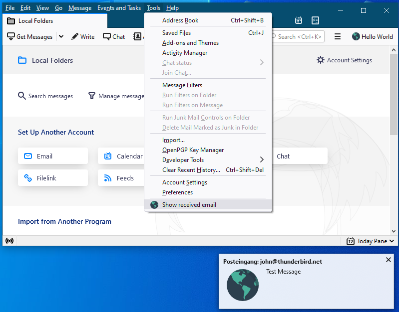
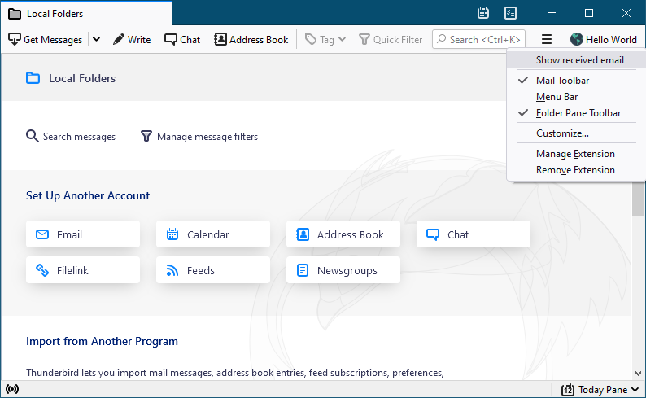

# Using a Background Page

In this third section of the Hello World Example, we will introduce the concept of the WebExtension background page.

We will keep track of incoming mails, add a menu entry to the tools menu and also a context menu entry to our toolbar button in the main Thunderbird toolbar and a click on both will open notifications with the collected information from the last 24h.



## Background Page and Background Scripts

In the first two sections of the Hello World Example, we used well-defined UI hooks to load HTML pages when the user opened one of our popups. In contrast, the background page - if defined - is automatically loaded when the add-on is enabled during Thunderbird start or after the add-on has been manually enabled or installed. It is automatically destroyed when the add-on is shutting down.

The background page is a standard HTML page, supporting the same technologies as ordinary HTML pages, but it is never shown to the user. Its main purpose is to load one or more JavaScript files into the background. Those background scripts can be used to listen for events or to initialize and properly set up the add-on. As [described in the MailExtension guide](../#background-page), there are two ways to load background scripts:

1. Actually defining a background HTML page, that uses `script` tags to load the JavaScript files.
2. Just defining the to-be-loaded JavaScript files and let Thunderbird create a background page on-the-fly.

The author of this example prefers the first option, as it allows declaring the loaded JavaScript file (in the script tag) as `type="module"`, which enables support for [using ES6 modules](https://developer.mozilla.org/en-US/docs/Web/JavaScript/Guide/Modules). We therefore add the following section to our `manifest.json` file:

```
"background": {
    "page": "background.html"
},
```

We place the following `background.html` file into our `hello-world` project folder:


```html
<!DOCTYPE html>
<html>
<head>
    <script src="background.js" type="module"></script>
</head>
</html>
```



Since we declare the `background.js` file as a module, we can use the JavaScript [`import`](https://developer.mozilla.org/en-US/docs/Web/JavaScript/Guide/Modules#importing_features_into_your_script) statement to load other JavaScript module files and have full control over our dependencies from within `background.js` and never have to adjust the `manifest.json` file or the `background.js` file in order to load additional JavaScript files.


Let's create an empty `background.js` script in the `hello-world` project folder, which we can extend in the following sections.

## Listening for New Messages

In order to listen for new messages, we have to add a listener for the [`onNewMessageReceived`](https://webextension-api.thunderbird.net/en/91/messages.html#onnewmailreceived) event to our background script:

```javascript
messenger.messages.onNewMailReceived.addListener(async (folder, messages) => {
    // Do something with folder and messages.
})
```

The above code is using an inline arrow function to define the callback function, which is called for each `onNewMailReceived` event. This is identical to the following implicit function definition:

```java
async function onNewMailReceivedCallback(folder, messages) {
    // Do something with folder and messages.
}
messenger.messages.onNewMailReceived.addListener(onNewMailReceivedCallback)
```

The author of this example prefers to use inline arrow functions, if the function is not used elsewhere.


The `onNewMessageReceived` event requires the <mark style="color:red;">`accountsRead`</mark> permission, which needs to be added to the `permissions` key in our `manifest.json` file.


The callback function of the `onNewMailReceived` event receives two parameters: `folder` being a [`MailFolder`](https://webextension-api.thunderbird.net/en/91/folders.html#folders-mailfolder) and `messages` being a [`MessageList`](https://webextension-api.thunderbird.net/en/91/messages.html#messages-messagelist). To store the folder and the message information of the new received mail, we add the following code to our background script:

```javascript
// A wrapper function returning an async iterator for a MessageList. Derived from 
// https://webextension-api.thunderbird.net/en/91/how-to/messageLists.html
async function* iterateMessagePages(page) {
    for (let message of page.messages) {
        yield message;
    }

    while (page.id) {
        page = await messenger.messages.continueList(page.id);
        for (let message of page.messages) {
            yield message;
        }
    }
}

// Listener for new message events.
messenger.messages.onNewMailReceived.addListener(async (folder, messages) => {
    let { messageLog } = await messenger.storage.local.get({ messageLog: [] });

    for await (let message of iterateMessagePages(messages)) {
        messageLog.push({
            folder: folder.name,
            time: Date.now(),
            message: message
        })
    }

    await messenger.storage.local.set({ messageLog });
})
```

#### messenger.storage.local.get()

In line 18 of the shown background script, we request the current `messageLog` entry from the WebExtensions local storage. The used syntax allows defining the default value of `[]`(an empty Array), if there currently is no `messageLog` entry stored. 

We could also request multiple values from the local storage:

```javascript
let rv = await messenger.storage.local.get({
  messageLog: [],
  aBoolValue: true,
  aStringValue: "none"
});
console.log(rv);
```

The call to `storage.local.get()` returns a Promise for a single object with the requested entries, for example the above `console.log(rv)` could produce the following output:

```
{
  messageLog: [],
  aBoolValue: false,
  aStringValue: "The sky is the limit."
}
```

To access the content of the `messageLog` member, one would have to use `rv.messageLog`. That is sometimes not the desired behavior, and instead one could store the requested value directly in a variable, as shown in line 18 of our background script. This is called _object destructering_ and it maps the content of the `messageLog` member of the returned object to the `messageLog` variable. Any other non-matching returned member is ignored.


Access to the local storage requires the <mark style="color:red;">`storage`</mark> permission, which needs to be added to the `permissions` key in our `manifest.json` file.


#### iterateMessagePages()

Since Thunderbird's WebExtension API potentially has to handle a lot of messages, the [`MessageList`](https://webextension-api.thunderbird.net/en/91/messages.html#messagelist) data type is paginated. Please check the [Working with Message Lists](https://webextension-api.thunderbird.net/en/91/how-to/messageLists.html) tutorial for more information.

The provided` iterateMessagePages()` wrapper function is doing most of the heavy lifting and allows to asynchronously loop over the returned messages in line 20 of the shown background script. For each received message, we subsequently push a new entry into the `messageLog` Array.

#### messenger.storage.local.set()

In line 28 we store the updated `messageLog` Array back into the local storage. We use the object shorthand notation, which allows leaving out the actual value definition, if the value is stored in a variable with the same name as the object's member name. If the shorthand notation is unwanted, one could instead write the following:

```javascript
await messenger.storage.local.set({ messageLog: messageLog });
```

## Adding a Context Menu Entry

Let's add the following code to your background script:

```javascript
async function addContextMenu() {
    let menu_id = await messenger.menus.create({
        title: "Show received email",
        contexts: [
            "browser_action",
            "tools_menu"
        ],
    });
    
    messenger.menus.onClicked.addListener(async (info, tab) => {
        if (info.menuItemId == menu_id) {
            // Our menu entry was clicked, get the log.
            let { messageLog } = await messenger.storage.local.get({ messageLog: [] });

            // Filter the data to the last 24h
            let now = Date.now();
            let last24h = messageLog.filter(e => (now - e.time) < 24* 60 * 1000);

            // Loop over the found entries and create a notification
            for (let entry of last24h) {
                messenger.notifications.create({
                    "type": "basic",
                    "iconUrl": messenger.runtime.getURL("images/internet.png"),
                    "title": `${entry.folder}: ${entry.message.author}`,
                    "message": entry.message.subject
                  });                
            }
        }
    });
}

document.addEventListener("DOMContentLoaded", addContextMenu);
```

TBD


Using the `menus` API requires the <mark style="color:red;">`menus`</mark> permission, which needs to be added to the `permissions` key in our `manifest.json` file.


## Testing the Extension

Let's double-check that we have all the files in the right places:

```
hello-world/
  ├── manifest.json
  ├── background.html
  ├── background.js
  ├── mainPopup/
      ├── popup.html
      ├── popup.css
      └── popup.js
  ├── messagePopup/
      ├── popup.html
      ├── popup.css
      └── popup.js
  └── images/
      ├── internet.png
      ├── internet-32px.png
      └── internet-16px.png
```

This is how our `manifest.json` should now look like:


```json
{
    "manifest_version": 2,
    "name": "Hello World",
    "description": "Your basic Hello World extension!",
    "version": "3.0",
    "author": "[Your Name Here]",
    "applications": {
        "gecko": {
            "id": "helloworld@yoursite.com",
            "strict_min_version": "78.0"
        }
    },
    "browser_action": {
        "default_popup": "mainPopup/popup.html",
        "default_title": "Hello World",
        "default_icon": "images/internet-32px.png"
    },
    "message_display_action": {
        "default_popup": "messagePopup/popup.html",
        "default_title": "Details",
        "default_icon": "images/internet-32px.png"
    },
    "permissions": [
        "messagesRead",
        "accountsRead",
        "storage",
        "menus",
        "notifications"
    ],
    "background": {
        "page": "background.html"
    },
    "icons": {
        "64": "images/internet.png",
        "32": "images/internet-32px.png",
        "16": "images/internet-16px.png"
    }
}
```


This is how our background script should look like:


```javascript
// A wrapper function returning an async iterator for a MessageList.
async function* iterateMessagePages(page) {
    for (let message of page.messages) {
        yield message;
    }

    while (page.id) {
        page = await messenger.messages.continueList(page.id);
        for (let message of page.messages) {
            yield message;
        }
    }
}

// Listener for new message events.
messenger.messages.onNewMailReceived.addListener(async (folder, messages) => {
    let { messageLog } = await messenger.storage.local.get({ messageLog: [] });

    for await (let message of iterateMessagePages(messages)) {
        messageLog.push({
            folder: folder.name,
            time: Date.now(),
            message: message
        })
    }

    await messenger.storage.local.set({ messageLog });
})

async function addContextMenu() {
    let menu_id = await messenger.menus.create({
        title: "Show received email",
        contexts: [
            "browser_action",
            "tools_menu"
        ],
    });
    
    messenger.menus.onClicked.addListener(async (info, tab) => {
        if (info.menuItemId == menu_id) {
            // Our menu entry was clicked
            let { messageLog } = await messenger.storage.local.get({ messageLog: [] });

            let now = Date.now();
            let last24h = messageLog.filter(e => (now - e.time) < 24* 60 * 1000);

            for (let entry of last24h) {
                messenger.notifications.create({
                    "type": "basic",
                    "iconUrl": messenger.runtime.getURL("images/internet.png"),
                    "title": `${entry.folder}: ${entry.message.author}`,
                    "message": entry.message.subject
                  });                
            }
        }
    });
}

document.addEventListener("DOMContentLoaded", addContextMenu);

```


### Installing

As described in the [first section of the Hello World Example](./#installing), go to the Add-ons Manager to open the Debug Add-on Page and temporarily install the extension.

### Trying it Out

After you have received one or more new message, while the add-on has been active, open the context menu of our `browser_action` button in Thunderbird's main toolbar and click on "Show received emails". For each received message, you should see a notification.


