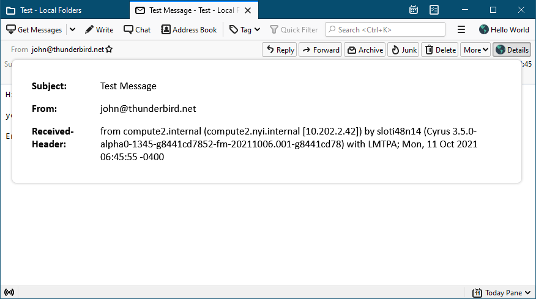

# Using WebExtension APIs

In this second section of the Hello World Example, we will add a "_Details_" button to the message header toolbar. A click on it will show some information about the currently displayed message, which we retrieve using Thunderbird's WebExtension APIs.



## Using a `message_display_action`

Similar to adding the `browser_action` in the first section of the Hello World Example, we have to extend the `manifest.json` to add the `message_display_action`.:

```
"message_display_action": {
    "default_popup": "messagePopup/popup.html",
    "default_title": "Details",
    "default_icon": "images/internet-32px.png"
},
```

### popup.html

The HTML file for our popup needs some place-holders, which we can later fill using JavaScript and Thunderbird's WebExtension APIs. Create a `messagePopup` folder inside the `hello-world` project folder and place the following `popup.html` file in the newly created folder:

```
<!DOCTYPE html>
<html>
<head>
    <meta charset="utf-8">
    <title>Details</title>
    <link rel="stylesheet" type="text/css" media="screen" href="popup.css">
    <script src="popup.js"></script>
</head>
<body>
    <div class="grid-container">
        <div class="header">Subject:</div><div id="subject" class="content"></div>
        <div class="header">From:</div><div id="from" class="content"></div>
        <div class="header">Received-Header:</div><div id="received" class="content"></div>
    </div>
</body>
</html>
```

### popup.css

Place the following `popup.css` file in the same folder as the `popup.html` file.

```
.grid-container {
    display: grid;
    grid-template-columns: 1fr 6fr;
}

.header {
    font-weight: bold
}

.grid-container div {
    margin: 1ex;
}
```

We use modern CSS styling to format our HTML into a tabular view (instead of using tables). The `display: grid` container defines how our 6 DIV elements inside the container DIV are aligned. Check the [grid documentation](https://developer.mozilla.org/de/docs/Web/CSS/CSS_Grid_Layout) or this [grid guide](https://css-tricks.com/snippets/css/complete-guide-grid/) for more details.

### popup.js

All WebExtension API functions return a [Promise](https://developer.mozilla.org/en-US/docs/Web/JavaScript/Guide/Using_promises) instead of an actual value. This aims to simplify the handling of asynchronous functions.

The author of this example prefers [the `async`/`await` syntax](https://developer.mozilla.org/en-US/docs/Learn/JavaScript/Asynchronous/Async_await) over the `.then()` approach for handling Promises. The `load()` function defined in the following `popup.js` is therefore defined as `async`. All used WebExtension API calls, or better all returned Promises of WebExtension API calls are awaited, which means the execution flow in this function sort of halts until the individual Promise is fulfilled. This allows to use asynchronous functions but still being able to write sequential code.

```
async function load() {
  // The user clicked our button, get the active tab in the current window using
  // the tabs API.
  let tabs = await messenger.tabs.query({active: true, currentWindow: true});

  // Get the message currently displayed in the active tab, using the
  // messageDisplay API. Note: This needs the messagesRead permission.
  // The returned message is a MessageHeader object with the most relevant
  // information.
  let message = await messenger.messageDisplay.getDisplayedMessage(tabs[0].id);

  // Update the HTML fields with the message subject and sender.
  document.getElementById("subject").textContent = message.subject;
  document.getElementById("from").textContent = message.author;
  
  // Request the full message to access its full set of headers.
  let full = await messenger.messages.getFull(message.id);
  document.getElementById("received").textContent = full.headers.received[0];
}

document.addEventListener("DOMContentLoaded", load);
```


In Thunderbird, all WebExtension API can be accessed through the _browser.\*_ namespace, as with Firefox, but also through the _messenger.\*_ namespace, which is a better fit for Thunderbird.


#### messenger.tabs.query

The [tabs API](https://webextension-api.thunderbird.net/en/91/tabs.html) provides access to Thunderbird's tabs. We need to get hold of the current active tab to learn which message is displayed there. We use the [`query`](using-webextension-apis.md#adding-a-message_display_action) method to find it (line 4).


Using `messeger.tabs.getCurrent()` will not work, as that always returns the tab in which it is being called from. In our case, the call is executed from inside the popup of the `message_display_action` and not from inside the tab we are looking for.


#### messenger.messageDisplay.getDisplayedMessage

The [`getDisplayedMessage`](https://webextension-api.thunderbird.net/en/91/messageDisplay.html#getdisplayedmessage-tabid) method of the [messageDisplay API](https://webextension-api.thunderbird.net/en/91/messageDisplay.html) provides access to the currently viewed message(s) in a given tab. It returns a Promise for a [MessageHeader](https://webextension-api.thunderbird.net/en/91/messages.html#messageheader) object from the [messages API](https://webextension-api.thunderbird.net/en/91/messages.html) with basic information about the message (line 10).

At this stage we are interested in the subject (line 13) and the author (line 14).

As mentioned in the documentation of the [`getDisplayMessage`](https://webextension-api.thunderbird.net/en/91/messageDisplay.html#getdisplayedmessage-tabid) method, the <mark style="color:red;">`messagesRead`</mark> permission is required to be able to use it. So we have to add a `permissions` section to our `manifest.json`.

```
"permissions": [
    "messagesRead"
],
```

#### messenger.messages.getFull

We also want to get the `received` header from the message. That information is not part of the general `MessageHeader` object, so we have to request the full message.

The [`getFull`](https://webextension-api.thunderbird.net/en/91/messages.html#getfull-messageid) method (line 17) returns a Promise for a [`MessagePart`](https://webextension-api.thunderbird.net/en/91/messages.html#messages-messagepart) object, which relates to messages containing multiple MIME parts. The `headers` member of the part returned by `getFull` includes the headers of the message (excluding headers which are part of nested MIME parts available through the `parts` member).

## Testing the Extension

Let's double-check that we have all the files in the right places:

```
hello-world/
  ├── manifest.json
  ├── mainPopup/
      ├── popup.html
      ├── popup.css
      └── popup.js
  ├── messagePopup/
      ├── popup.html
      ├── popup.css
      └── popup.js
  └── images/
      ├── internet.png
      ├── internet-32px.png
      └── internet-16px.png
```

This is how our `manifest.json` should now look like:

```
{
    "manifest_version": 2,
    "name": "Hello World",
    "description": "Your basic Hello World extension!",
    "version": "2.0",
    "author": "[Your Name Here]",
    "applications": {
        "gecko": {
            "id": "helloworld@yoursite.com",
            "strict_min_version": "78.0"
        }
    },
    "browser_action": {
        "default_popup": "mainPopup/popup.html",
        "default_title": "Hello World",
        "default_icon": "images/internet-32px.png"
    },
    "message_display_action": {
        "default_popup": "messagePopup/popup.html",
        "default_title": "Details",
        "default_icon": "images/internet-32px.png"
    },
    "permissions": [
        "messagesRead"
    ],
    "icons": {
        "64": "images/internet.png",
        "32": "images/internet-32px.png",
        "16": "images/internet-16px.png"
    }
}
```

### Installing

As described in the [first section of the Hello World Example](./#installing), go to the Add-ons Manager to open the Debug Add-on Page and temporarily install the extension.

### Trying it Out

Open any message and you will find a "_Details_" button in the message header toolbar. A click on it will show you the `subject`, the `author` and the first found `received` header of the currently viewed message.
